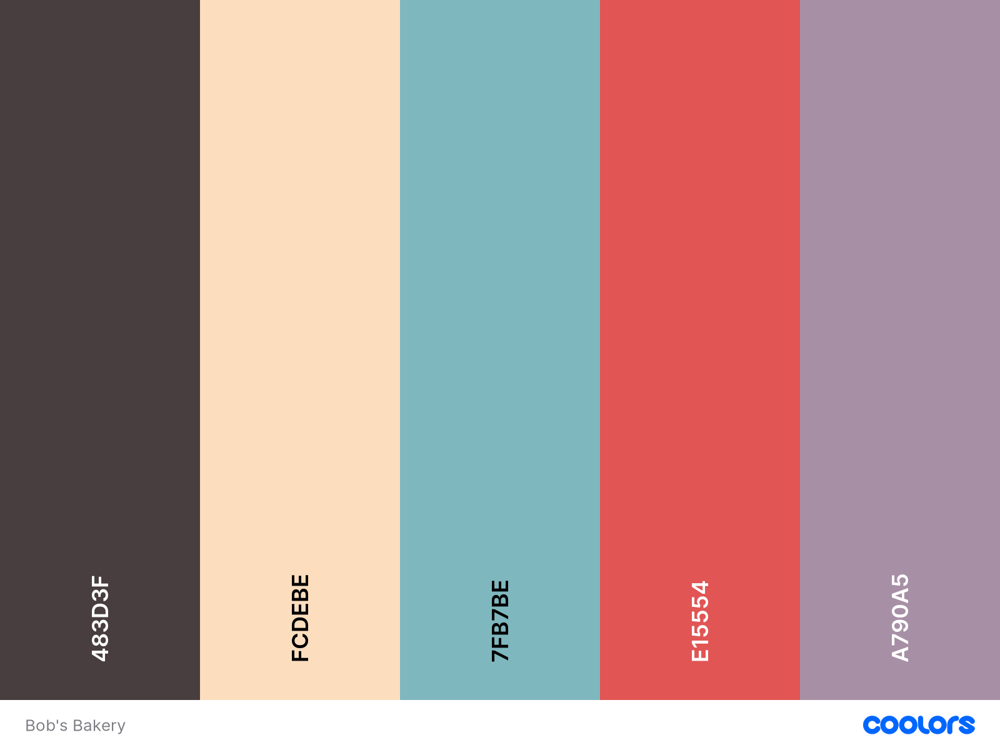

# Bobs Bakery Website

This site was created to showcase my amazing skills as a baker(and aspiring Web Developer). The site is designed to be responsive, intuitive and accessible. 

<!-- add amiresponsive screenshot of responsive site when created -->

Fancy stepping into the world of baked goods? 

Head to the deployed site at [Bob's Bakery](https://www.example.com).

## Table of Contents
- User Experience(UX) <!-- replace with links -->
  - Initial Discussion
  - Demographic
  - User Stories <!-- replace with links -->

## User Experience
### Initial Discussion

Bob's Bakery is a local, family-owned bakery in the heart of Gateshead. They sell a wide-range of sweet goods as well as savoury goods. Bob's Bakery would like to increase their footfall, and want to do this by having an online presence. 

Bob's Bakery would also like to interact with their customers through social media and direct contact.

### Demographic
With the site being in the heart of Gateshead, and there being a travel hub within the building, there is a wide range to cater for. Below I have listed what they may be interested in.

  - Teens 
    - Sweet tasty cakes, doughnuts and cookies etc.
  - Students
    - Quick, convenient food such as pasties, sausage rolls, pre-made sandwiches etc.
  - Young Professionals
    - Meal deals(sandwich, crisps and drink)
  - Families
    - Bread, Pastries, and personalized cakes(incl birthday cakes).

### User Stories

- Client Goals
  - To have an online presence.
  - To display a wide range of produce on the site.
  - To increase traffic to the physical site.
  - Increase interaction with customers via social media and contact forms.

- First Time Visitor Goals 
  - I want to be able to navigate the site easily.
  - I want to be able to access their menu, including prices.
  - I want to find out opening times and location.
  - I want to find out about the services offered.

- Returning Visitor Goals
  - As a returning visitor, I want to find out about new products.
  - As a returning visitor, I want to be able to access their social media.

- Frequent Visitor Goals
  - As a returning visitor, I want to be able to order items for click and collect.

### Strategic Trade offs

| Opportunity/Problem | Importance | Viability/Feasability |
| ----------- | ----------- | ----------- |
| Create an online presence | 5 | 5 |
| Display a wide range of produce on the site | 4 | 5 |
| Increase social media interaction | 5 | 5 |
| Create a click and collect system| 3 | 1 |
| Email marketing campaign | 2 | 2 |
| Total | 19 | Avg 18 |

Above I have listed documented some trade-offs and I will explain the reasoning behind them.

- Online presence
  - This is mandatory and should be achievable given that I am a Front-End Web Developer(the course upto now has given everything I need to achieve this).

- Produce Range
  - Not as important as an online presence, but most definitely still up there. I feel it is also feasible given my skillset

- Social media interaction
  - Again, this is well within my skillset as this could be something as simple as a CTA or footer icons with links to social media.

- Click & Collect
  - In order to get a click & collect system similar(Just-Eat) to other sites I would need to expand my knowledge.This isn't something I feel I have the knowledge for at the moment, so the feasiblity for it scores a one. However, this doesn't mean that it won't be implemented in future updates.

- Email marketing
  - This could involve a signup form and database of customer emails. There is technology that would handle this for me however I don't feel I have the time or knowledge to implement this.

## Design

### Colour Scheme

We wanted to use a colour scheme that wasn't going to distract too much from the text but also make the website pop, and look fun. From the competitors websites, I found a lot of local bakeries were tending to use pastel type colours.

### Typography

We decided that we didn't want to overcomplicate the typography, and settled on Roboto, with a fallback font of Sans-serif. 

Font weights for Roboto are regular(400) and medium(500). Regular is used for the text on the pages and medium is used for headings. 

### Imagery

Being a local, family-owned bakery, we decided to opt in for images that are warm & welcoming. Using imagery we want to also convey that the bakery is open to all.

### Wireframes & Sitemap

Bob's Bakery Sitemap

The sitemap allows me to get an high-level view view of how the user will navigate the site. Products being the priority for returning users, then reviews & gallery for first-time users, and contact for frequent users.

[Sitemap](assets/readme/sitemap.png)

[Mobile Wireframe](assets/readme/mobile.png)

[Tablet Wireframe](assets/readme/tablet.png) 

[Desktop Wireframe](assets/readme/desktop.png)

