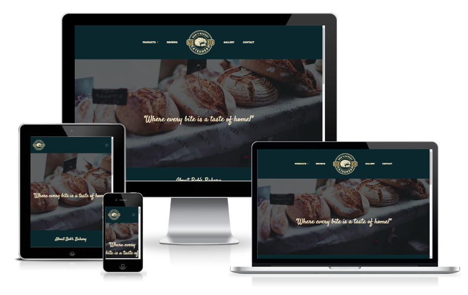
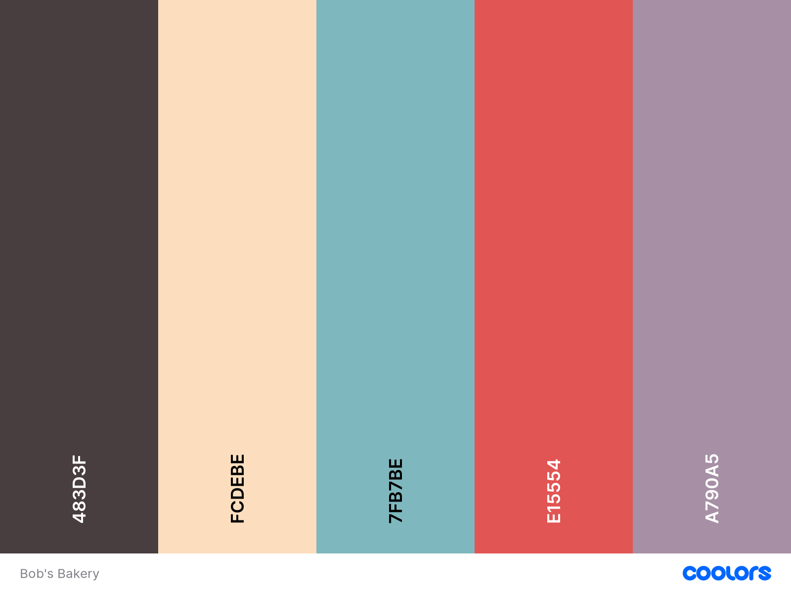
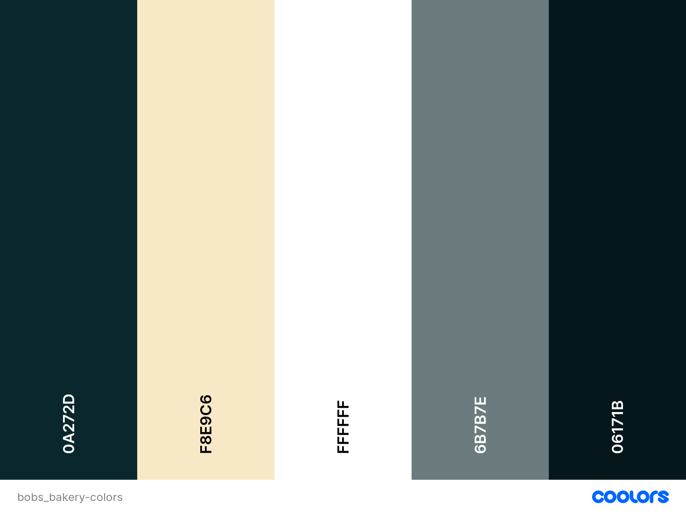

# Bobs Bakery Website

This site was created to showcase my amazing skills as a baker(and aspiring Web Developer). The site is designed to be responsive, intuitive and accessible. 

Fancy stepping into the world of baked goods? 

Head to the deployed site at [Bob's Bakery](https://www.example.com).

## Table of Contents
* [User Experience](#User-Experience)
  * [Initial Discussion](#Initial-Discussion)
  * [Demographic](#Demographic)
  * [User Stories](#User-Stories) 
  * [Strategic Trade offs](#Strategic-Trade-offs)
* [Design](#Design)
  * [Colour Scheme](#Colour-Scheme)
  * [Typography](#typography)
  * [Imagery](#Imagery)
  * [Wireframes/Sitemap](#Wireframes/Sitemap)
  * [Features](#Features)
  * [Future Implementations](#Future-Implementations)
  * [Accessibility](#Accessibility)
* [Technologies Used](#Technologies-Used)
  * [Languages Used](#Languages-Used)
  * [Software, Frameworks & Libraries Used](#Software,-Frameworks-&-Libraries-Used)
* [Testing](#Testing)
  * [Validation](#Validation)
  * [Fixed Bugs](#Fixed-Bugs)
  * [Known Issues](#Known-Issues)
  * [Testing User Stories](#Testing-User-Stories)
  * [Lighthouse](#Lighthouse)
    * [Index Page](#Index-Page)
    * [Products Page](#Products-Page)
    * [Reviews Page](#Reviews-Page)
    * [Gallery Page](#Gallery-Page)
    * [Contact Page](#Contact-Page)
  * [Manual Testing](#Manual-Testing)
* [Deployment & Local Development](#Deployment-&-Local-Development)
  * [Deploying to Github Pages](#Deploying-to-Github-Pages)
  * [Local Development](#Local-Development)
    * [How to Fork](#How-to-Fork)
    * [How to Clone](#How-to-Clone)
  * [Credits](#Credits)
    * [Images](#Images)
    * [Acknowledgement](#Acknowledgement)

## User Experience
### Initial Discussion

Bob's Bakery is a local, family-owned bakery in the heart of Gateshead. They sell a wide-range of sweet goods as well as savoury goods. Bob's Bakery would like to increase their footfall, and want to do this by having an online presence. 

Bob's Bakery would also like to interact with their customers through social media and direct contact.

### Demographic
With the site being in the heart of Gateshead, and there being a travel hub within the building, there is a wide range to cater for. Below I have listed what they may be interested in.

  - Teens 
    - Sweet tasty cakes, doughnuts and cookies etc.
  - Students
    - Quick, convenient food such as pasties, sausage rolls, pre-made sandwiches etc.
  - Young Professionals
    - Meal deals(sandwich, crisps and drink)
  - Families
    - Bread, Pastries, and personalized cakes(incl birthday cakes).

### User Stories

- Client Goals
  - To have an online presence.
  - To display a wide range of produce on the site.
  - To increase traffic to the physical site.
  - Increase interaction with customers via social media and contact forms.

- First Time Visitor Goals 
  - I want to be able to navigate the site easily.
  - I want to be able to access their menu, including prices.
  - I want to find out opening times and location.
  - I want to find out about the services offered.

- Returning Visitor Goals
  - As a returning visitor, I want to find out about new products.
  - As a returning visitor, I want to be able to access their social media.

- Frequent Visitor Goals
  - As a returning visitor, I want to be able to order items for click and collect.

### Strategic Trade offs

| Opportunity/Problem | Importance | Viability/Feasability |
| ----------- | ----------- | ----------- |
| Create an online presence | 5 | 5 |
| Display a wide range of produce on the site | 4 | 5 |
| Increase social media interaction | 5 | 5 |
| Create a click and collect system| 3 | 1 |
| Email marketing campaign | 2 | 2 |
| Total | 19 | Avg 18 |

Above I have listed documented some trade-offs and I will explain the reasoning behind them.

- Online presence
  - This is mandatory and should be achievable given that I am a Front-End Web Developer(the course upto now has given everything I need to achieve this).

- Produce Range
  - Not as important as an online presence, but most definitely still up there. I feel it is also feasible given my skillset

- Social media interaction
  - Again, this is well within my skillset as this could be something as simple as a CTA or footer icons with links to social media.

- Click & Collect
  - In order to get a click & collect system similar(Just-Eat) to other sites I would need to expand my knowledge.This isn't something I feel I have the knowledge for at the moment, so the feasiblity for it scores a one. However, this doesn't mean that it won't be implemented in future updates.

  *Note: Upon looking at the logistics of the click & collect system I realised that it doesn't necessarily have to be as complicated as Just-Eat. Customers can use the contact form to essentially order from the menu. 

- Email marketing
  - This could involve a signup form and database of customer emails. There is technology that would handle this for me however I don't feel I have the time or knowledge to implement this.

## Design

### Colour Scheme

We wanted to use a colour scheme that wasn't going to distract too much from the text but also make the website pop, and look fun. From the competitors websites, I found a lot of local bakeries were tending to use pastel type colours.

 

NOTE:

I felt that the color scheme did not accurately represent the atmosphere and values of Bob's Bakery, and it did not match the theme of being "Warm and Welcoming." The color scheme below is what was used in the final product.

 

### Typography

We decided that we didn't want to overcomplicate the typography, and settled on Roboto, with a fallback font of Sans-serif. 

Font weights for Roboto are regular(400) and medium(500). Regular is used for the text on the pages and medium is used for headings. 

### Imagery

Being a local, family-owned bakery, we decided to opt in for images that are warm & welcoming. Using imagery we want to also convey that the bakery is open to all.

[Unsplash](https://unplash.com "Unsplash Free Images & Pictures")  
[Pexels](https://www.pexels.com/ "Pexels Stock Photo Site")
### Wireframes/Sitemap

Bob's Bakery Sitemap

The sitemap allows me to get an high-level view view of how the user will navigate the site. Products being the priority for returning users, then reviews & gallery for first-time users, and contact for frequent users.

[Sitemap](assets/readme/sitemap.png)

[Mobile Wireframe](assets/readme/mobile.png)

[Tablet Wireframe](assets/readme/tablet.png) 

[Desktop Wireframe](assets/readme/desktop.png)

Wireframes were initially created using [Balsamiq](https://balsamiq.com/wireframes/ "Balsamiq Wireframes Software") on Ubuntu however there were some limitations which resulted in me switching to Windows 10 version.

### Features

Bob's Bakery website consists of 5 pages(Homepage, Products, Reviews, Gallery and Contact).

Features in common across the site include:-

* A responsive navigation bar across the top of the site. This allows users on different screen sizes to view the same site on any device. In the centre of the navbar we have the Bob's Bakery logo and on either side there are navigation links:-

    *  Products - links to the products page with 4 individual menus(Cakes, Breads, Pastries and Meal Deals)
        * Cakes
        * Breads
        * Pastries
        * Meal Deals 
        * Download Menu - downloads the product menu as a pdf.
    *  Reviews - navigates to Bob's Bakery customer reviews.
    * Bob's Bakery Logo - navigates back to the index.html page or more commonly known as home. The logo moves from the centre of the navbar on devices smaller than 992px to the left-hand side creating a better user experience. 
    * Gallery - navigates to a 3x3 grid gallery of Bob's Bakery products.
    * Contact - navigates to the contact page which includes a form, address and google map embed.

There is also a hamburger menu icon included in the navbar which allows for a better user experience on smaller devices. On each page where applicable there is also a back to top button which also allows for a better user experience.

A footer is inluded across all pages of the site with opening times, social media icons which open in a new window and the Bakery address.

* Home page:- 
  * A hero image of various baking produce(baguettes, cobs and loaves). Along with the navbar logo, this helps the user understand almost immediately what the site is about.
  * A thought provoking phrase, "Where every bite is a taste of home!".
  * About Section contains a short paragraph about Bob's Bakery, introducing the customer to who we are and our mission to be a "cornerstone of the Gateshead community".
  * A three card sample products section with individual descriptions of what Bob's Bakery offers.
      
* Products Page:-
  * contains 4 menus each relating to the dropdown menu navigation links. Included are the prices of each item and a footnote for the menu detailing services relating to that category.

* Reviews Page:- 
  * contains 3 cards with a star rating system. Underneath the star rating there is also a short review about the product the customer bought. 
  * each card contains a customer-name in the footer of the card to add a sign of authenticity to the review.

* Gallery Page:-
  * contains a 3x3 responsive grid with numerous Bob's Bakery products and small description underneath of what the product is.

* Contact Page:- 
  * contains a contact form which can be used for ordering or any other query. As part of form validation I have set the name, email and customer query fields to required. This prompts the user to enter details if they have been missed. The form can be submitted using the submit button which POSTS to https://formdump.codeinstitute.net and returns values entered. 
  * the address of Bob's Bakery and directions from the A1, Gateshead Metro Interchange and Newcastle Central Station.
  * contains a functional Google Map embed of the location of Bob's bakery. In the future I could potentially add pins to the map to show the exact location, using JavaScript.

### Future Implementations
* add pins to the Google Embed page using JavaScript
* use JavaScript and JSON to send customer orders via email(contact form) to build a more robust and intuitive order form. *Note: Not entirely sure if this possibly with the technologies chosen.

### Accessibility

Whilst coding the site I have ensured that the site is accesible for all. This is achieve by using:-

* Using Google Dev tools to check contrast of items. 
* Using alt tags to describe the images on site.
* Using semantic HTML

## Technologies Used

### Languages Used 
* HTML and CSS
* JavaScript - however this was the Hamburger Dropdown from Bootstrap.

### Software, Frameworks & Libraries Used

* [Balsamiq](https://www.balsamiq.com/wireframes "Balsamiq Wireframing Tool") was used to create the wireframes/sitemap for the site.
* [Bootstrap Version 4.6 ](https://getbootstrap.com/docs/4.6/getting-started/introduction/ "Bootstrap Framework") was used to create the navigation bar, cards and form. They were modified to my suit needs. As a personal note to future myself, whilst Bootstrap is a excellent framework to get stuck into I feel it pulls away from the practising of core CSS, resulting in a lot of overriding.
* [Canva](https://www.canva.com/ "Canva") was used to create Bob's Bakery Logo, Favicon and to also get some potential ideas. This was also used to create the menu pdf shown in the navbar.
* [Font Awesome](https://fontawesome.com/icons "Font Awesome 6.2.1 Free Icons") was used for the stars icons seen on the reviews page and the social media icons in the footer.
* [Firefox Developer Edition](https://www.mozilla.org/en-GB/firefox/developer/ "Firefox Developer Edition") this was used to find out specific measurements with the ruler tool so that each page had exactly the same padding between the last section row and footer.
* [Google Fonts](fonts.google.com "Google Fonts") we used the Satisfy font and also the Roboto font. These can been seen in action as page-headings/slogan-text and in the navbar.
* Google Dev Tools were utilized to identify and resolve problems related to responsiveness and appearance. 
* [Github](https://github.com/ "Github") was used to store my project in a repository. 
* [Git](https://git-scm.com/ "Git Version Control") was used for Version Control.
* [Google](https://www.google.co.uk "Google Search Engine") was used to research HTML & CSS.
* [Gitpod](https:://www.gitpod.io "Gitpod Cloud IDE") the vast majority of my time was spent inside GitPod's VSCode Cloud IDE.
* CDNs [Cloudflare](https://www.cloudflare.com/en-gb/learning/what-is-cloudflare/ "Cloudflare CDN") and  [JsDelivr](https://www.jsdelivr.com/ "JsDelivr") were used for Font Awesome icons CSS minified and Bootstrap 4.6 CSS minified.
* Pomodoro Timer - to stop me from procrastinating.
* [Trello](https://trello.com "Trello") was used to try and keep track of To-Dos and Completed Tasks. 

## Testing

### Validation
I used the W3C Markup Validation Service on all pages of Bob's Bakery. I also validated the my own style.css with the CSS Validator.

* [Index Page HTML](assets/readme/docs/bobsbakery-index-validation.png)
* [Products Page HTML](assets/readme/docs/bobsbakery-products-validation.png)
* [Reviews Page HTML](assets/readme/docs/bobsbakery-reviews-validation.png)
* [Gallery Page HTML](assets/readme/docs/bobsbakery-gallery-validation.png)
* [Contact Page HTML](assets/readme/docs/bobsbakery-contact-validation.png)
* [Stylesheet style.css](assets/readme/docs/bobsbakery-jigsaw-w3-org-css-validator.png) 

### Fixed Bugs

* Bug 1:
  * Expected - expected the products link to stay above the other navigation items and uniform on smaller screens.
  * Testing - resizing the browser window to 991px to replicate the error.
  * Result - using devTools in Chrome it was narrowed down to the bootstrap scss reboot targeting the body class.
  * Fix - adding the bootstrap class "text-center" to the products navigation link which fixed the issue by overriding the above.

[Products DD Bug](assets/readme/docs/products-dd-bug.png)
[Products DD Fix](assets/readme/docs/products-dd-fix.png)

### Known Issues

* Issue 1:
  * Bob's Bakery Logo does not sit centralized to the page. 
  * On further inspection this look as though it is the caret on products that is pushing out ever so slightly. See below:-
  [Bob's Bakery Logo](assets/readme/docs/products-caret-known-issue.png)
  

### Testing User Stories

* First Time Visitor Goals
  *  I want to be able to navigate the site easily.
  [Navigate Easily](assets/readme/docs/navbar-user-goal.png)
  *  To display a wide range of produce on the site.
  [Display Wide Range Produce](assets/readme/docs/display-produce-user-goal.png)
  * I want to find out opening times and location.
  [Opening Times and Location](assets/readme/docs/opening-hours-location-user-goal.png)
  * I want to find out about the services offered.
  [Services Offered](assets/readme/docs/services-offered-user-goal.png)
* Returning Visitor Goals
  * As a returning visitor, I want to find out about new products.
  [New Products](assets/readme/docs/new-products-user-goal.png)
  * As a returning visitor, I want to be able to access their social media.
  [Social Media](assets/readme/docs/social-media-user-goal.png)
* Frequent Visitor Goals
  * As a returning visitor, I want to be able to order items for click and collect.
  This is mentioned in the strategic tradeoffs section as it was not feasible to complete such a service similar to Just-Eat. We can however use the contact form to order in the "How can we help you today?" box.
  [Click & Collect](assets/readme/docs/click-collect-user-goal.png)
### Lighthouse
 #### Index Page
 #### Products Page
 #### Reviews Page
 #### Gallery Page
 #### Contact Page
### Manual Testing

## Deployment & Local Development

### Deploying to Github Pages

### Local Development
#### How To Fork
#### How To Clone

## Credits

### Images

### Acknowledgement